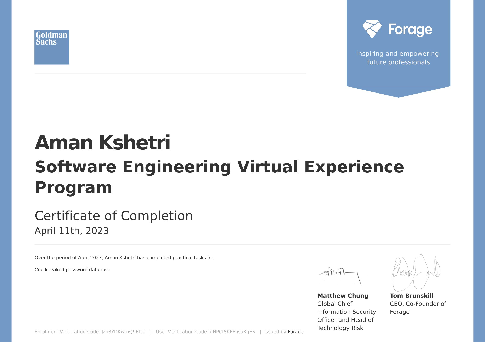

# Goldman-Sachs-Virtual-Experience
This repository contains the submitted files of the tasks assigned by the Goldman Sachs Software Engineering Virtual Internship

---
### Our job is to crack as many passwords as possible with available tools (e.g. use Hashcat). 

### Task : Crack leaked password database
The practical skills I gained from working on this task:
- `Cryptography Basics` 
- `Password Cracking`
- `Password Best Practise`

---
#### Certificate of Completion

